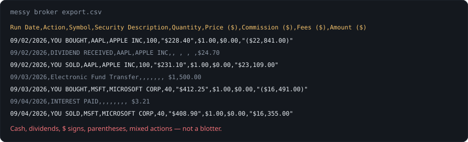
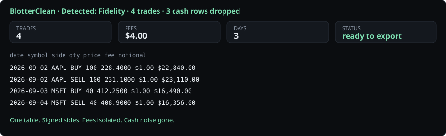

# 🧼 BlotterClean

**Paste a messy broker CSV. Get a clean trade blotter.**

[](LICENSE)
[](#-privacy)
[](#-quick-start)

Broker portals dump chaos: `YOU BOUGHT`, `$228.40`, `($22,841.00)`, dividends mixed with fills, three fee columns, dates like `09/02/2026;09:31:02`.

BlotterClean turns that into one table: **date · symbol · side · qty · price · fee · P&L · notional**.

Then you export it. The file never leaves your machine.

---

## 👀 Before → after

### ❌ Raw export (the pain)



### ✅ BlotterClean output (the point)



Same data. Cash and dividend noise gone. Sides normalized. Fees summed.

---

## ✨ What it does

| Ability | Detail |
|---|---|
| 🧠 **Scored header matching** | Token overlap + alias lexicon, not exact string equality |
| 🏦 **Broker fingerprints** | IBKR, Fidelity, Schwab, Robinhood, Trading 212, thinkorswim, Webull, E*TRADE |
| 🧽 **Preamble skip** | Finds the real header even if the file starts with account junk |
| 🌍 **Number locales** | `$1,234.56`, `1.234,56`, `(1.00)` negatives |
| 🧽 **Cash filter** | Drops deposits, ACH, dividends, interest when the row is not a fill |
| 📐 **Fee-aware sizer** | Risk % → size after round-trip fees |
| 📤 **Export** | Canonical CSV you can drop into a journal or spreadsheet |
| 🔒 **On-device** | No server. No account. No upload |

---

## 🚀 Quick start

```bash
git clone https://github.com/toonice/blotterclean.git
cd blotterclean
python3 -m http.server 8080
```

Open http://localhost:8080 → pick a sample → **Clean blotter**.

Or double-click `index.html` (the sample dropdown needs a local server because of `fetch`).

---

## 📁 Samples included

| File | Pretends to be |
|---|---|
| `samples/generic.csv` | Simple 6-column blotter |
| `samples/ibkr_flex_like.csv` | IBKR Flex |
| `samples/fidelity.csv` | Fidelity history (`YOU BOUGHT`) |
| `samples/schwab.csv` | Schwab (`Fees & Comm`) |
| `samples/robinhood.csv` | Robinhood activity (`Trans Code`) |
| `samples/trading212.csv` | Trading 212 (`Price / share`) |

---

## 🧪 How the matcher works

1. Count `,` `;` tab → pick delimiter
2. Score the first 25 rows for header-like tokens → pick header
3. Score every column against field lexicons (`symbol` / `ticker` / `instrument`)
4. Fingerprint the header set against known brokers
5. Parse numbers, infer BUY/SELL from action text **or** signed qty **or** proceeds
6. Drop cash-like rows unless the action is clearly a fill

Unknown brokers still parse if columns look like trades. Exotic layouts can still fail. That is honest.

---

## ⚠️ Not this product

- Not tax software. No wash-sale engine.
- Not a journal. No charts, no streaks.
- Not a broker API. You bring the CSV.
- PDF statements are not CSV.

Always check totals against the statement.

---

## 🛡️ Privacy

Parsing is 100% in the browser. Refresh the page and the file is gone.

---

## 📄 License

MIT © 2026 Manish Trivedi
